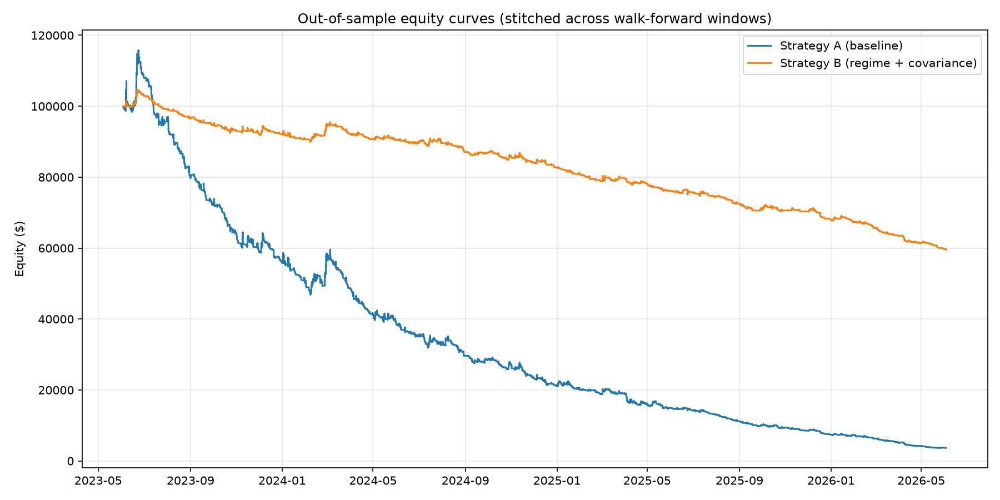

# Strategy A (baseline) vs Strategy B (regime + covariance + vol targeting)

Data range: 2022-06-03 to 2026-07-01 (12 walk-forward windows, 12mo train / 3mo test, rolling forward by 3mo). Starting capital: $100,000. Baseline cost assumption: 0.10% slippage.

## Methodology and key assumptions

- Both strategies pass through the identical pipeline: same cached historical data, same walk-forward split dates, same starting capital, same cost scenarios.
- Strategy A and Strategy B each optimize their OWN parameters independently per window (std-dev threshold for mean reversion, ATR trailing multiplier for momentum/trend) via in-sample grid search; ADX regime cutoffs (20/25) are fixed, matching the original walk-forward spec.
- Parameter thresholds are optimized on a single-instrument backtest with a common ATR-1%-risk sizing proxy (both strategies), to keep the grid search tractable across 5 instruments x many windows. Final performance figures use each strategy's REAL sizing logic (A: fixed ATR-risk + binary correlation filter; B: volatility targeting + covariance-aware sizing + kill switches) in a full shared-equity portfolio simulation.
- Parameters are optimized once at the baseline 0.10% slippage; the 0.05%/0.10%/0.15% cost scenarios are a sensitivity pass over those fixed parameters, not independently re-optimized.
- BTC/USD momentum breakout never shorts in either strategy -- Alpaca does not support shorting crypto, so both strategies are held to that real constraint identically.
- Strategy B's volatility-targeting scale-up cap is modeled at its post-validation steady-state (1.5x), not the conservative 1.0x-only cap mandated for a live system's first 4-6 weeks -- a historical backtest has no "early rollout" period.
- Stops are checked against bar close, not intrabar high/low, consistent with how the live bot polls.
- Strategy B's kill switches (drawdown halt, vol-breach size cut) are active in this backtest since they're part of the Phase 1-6 system as specified. This means part of any drawdown improvement B shows could come from the kill switches rather than from regime/covariance intelligence specifically -- a confound worth isolating via an ablation run if the headline result here looks close.

## Summary: out-of-sample, stitched across all walk-forward windows

| Metric | Strategy A | Strategy B |
|---|---|---|
| Sharpe | -3.461 | -2.510 |
| Sortino | -5.160 | -3.571 |
| Max drawdown | 96.835% | 43.029% |
| Recovery (days) | n/a | n/a |
| Win rate | 26.450% | 24.858% |
| Profit factor | 0.515 | 0.522 |
| Trade count | 1845.000 | 1058.000 |
| Total return | -96.335% | -40.416% |
| Final equity | 3665.480 | 59583.901 |

## In-sample vs out-of-sample Sharpe per window

| Window | Train | Test | A IS | A OOS | B IS | B OOS | A OOS degradation | B OOS degradation |
|---|---|---|---|---|---|---|---|---|
| 0 | 2022-06-03 | 2023-06-03 | -1.292 | -2.496 | -2.085 | -1.565 | FLAG | FLAG |
| 1 | 2022-09-03 | 2023-09-03 | -0.940 | -6.312 | -0.555 | -3.452 | FLAG | FLAG |
| 2 | 2022-12-03 | 2023-12-03 | -1.648 | -0.132 | -0.687 | 1.330 | FLAG |  |
| 3 | 2023-03-03 | 2024-03-03 | -1.748 | -4.761 | -0.963 | -2.862 | FLAG | FLAG |
| 4 | 2023-06-03 | 2024-06-03 | -2.582 | -2.769 | -1.540 | -1.879 | FLAG | FLAG |
| 5 | 2023-09-03 | 2024-09-03 | -2.901 | -3.131 | -1.644 | -2.005 | FLAG | FLAG |
| 6 | 2023-12-03 | 2024-12-03 | -2.830 | -1.684 | -1.605 | -2.816 | FLAG | FLAG |
| 7 | 2024-03-03 | 2025-03-03 | -3.287 | -2.797 | -2.133 | -2.799 | FLAG | FLAG |
| 8 | 2024-06-03 | 2025-06-03 | -2.804 | -6.429 | -1.975 | -3.297 | FLAG | FLAG |
| 9 | 2024-09-03 | 2025-09-03 | -3.735 | -3.899 | -1.678 | -1.360 | FLAG | FLAG |
| 10 | 2024-12-03 | 2025-12-03 | -3.986 | -4.817 | -1.745 | -5.349 | FLAG | FLAG |
| 11 | 2025-03-03 | 2026-03-03 | -4.476 | -7.435 | -2.174 | -7.077 | FLAG | FLAG |

**Parameter stability**: unstable optimal parameters across windows for: A/USO

## Monte Carlo (1000 trade-sequence resamples, out-of-sample trades)

| | Strategy A | Strategy B |
|---|---|---|
| Sharpe 5th pct | -6.368 | -5.625 |
| Sharpe median | -4.413 | -3.515 |
| Sharpe 95th pct | -2.890 | -2.203 |
| Max DD 5th pct | 92.873% | 33.112% |
| Max DD median | 96.559% | 41.691% |
| Max DD 95th pct | 98.149% | 49.321% |
| N trades resampled | 1845 | 1058 |

**Viability flag (95th pct MC drawdown > 20%)**: A=FLAG, B=FLAG

## Statistical significance: paired block bootstrap on daily returns

- Observed annualized Sharpe: A = -3.462, B = -2.512
- Observed Sharpe difference (B - A): 0.951
- 95% bootstrap CI on the difference: [0.267, 1.650]
- Two-sided p-value: 0.0060
- **Statistically significant at 5%: YES** (n=1096 paired daily observations, 1000 resamples, block size 10 days)

## Performance by regime period (SPY-derived: bullish / correction / vol shock / neutral)

| Regime | Days | A return | A Sharpe | A trades | B return | B Sharpe | B trades |
|---|---|---|---|---|---|---|---|
| BULLISH | 619 | -90.263% | -3.859 | 1478 | -31.372% | -2.794 | 823 |
| CORRECTION | 19 | -12.997% | -4.054 | 39 | -1.737% | -4.382 | 20 |
| VOL_SHOCK | 13 | -0.683% | -0.362 | 29 | -1.483% | -9.192 | 17 |
| NEUTRAL | 101 | -50.683% | -8.101 | 235 | -10.184% | -5.189 | 135 |

## Transaction cost sensitivity (out-of-sample total return, fixed walk-forward parameters)

| Slippage | A total return | B total return |
|---|---|---|
| 0.05% | -75.495% | -17.557% |
| 0.10% | -96.335% | -40.416% |
| 0.15% | -99.532% | -57.447% |

**Edge survives 0.15% slippage**: A=NO, B=NO

## Conclusion

Out-of-sample, Strategy B shows the higher Sharpe ratio (A=-3.461, B=-2.510). Strategy B shows the smaller max drawdown (A=96.835%, B=43.029%). The paired bootstrap significance test DOES reject the null hypothesis at the 5% level, in favor of B -- the gap between strategies on this data is unlikely to be pure noise. This is evidence the added complexity of Strategy B is earning its keep on a risk-adjusted basis, though the regime-breakdown and Monte Carlo tables above should be checked to confirm the edge isn't concentrated in a single regime or a lucky trade cluster before trusting it going forward.

